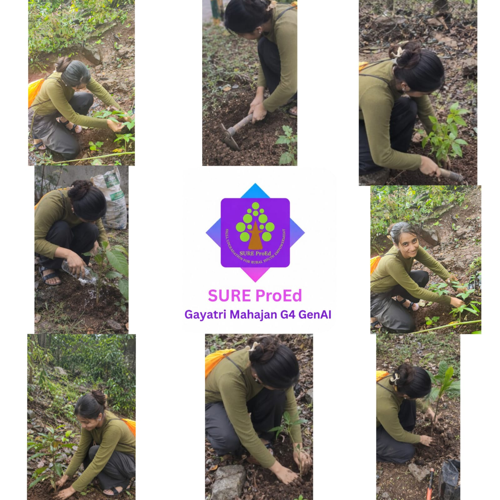
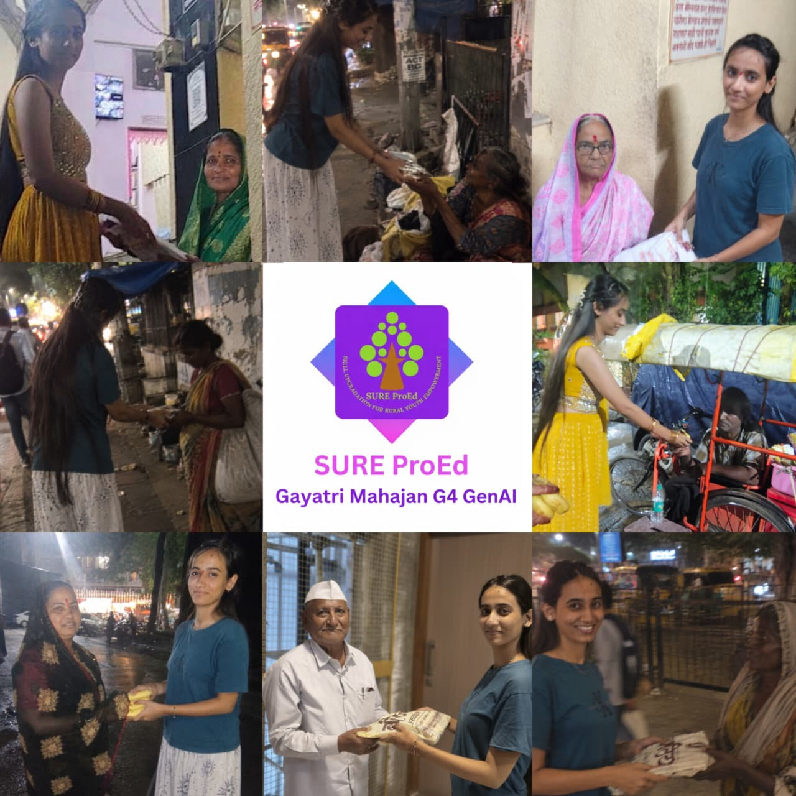

# GAYATRI-SANJEEV-MAHAJAN-g4-gen-a

    

  <h1 align="center" style="font-family: Arial; font-weight: 600; margin-top: 15px;">SURE ProEd (formerly SURE Trust) 
      </h1>
<h2 style="color: #2b6cb0; font-family: Arial;">Skill Upgradation for Rural youth Empowerment Trust</h2>

<h2 style = "color:#333;"> Student Details </h2>

    
<strong>Name:</strong> Gayatri Sanjeev Mahajan 

    
<strong>Email ID:</strong> gayatrimahajang3genai@gmail.com 

    
<strong>College Name:</strong> Terna Engineering College 

    
<strong>Branch/Specialization :</strong> Computer Engineering 

    
<strong>College ID:</strong> gayatrimahajan2324@ternaengg.ac.in 

<h2 style="color:#333;"> Course Details </h2>

    
<strong>Course Opted:</strong> Generative AI 

    
<strong>Instructor Name:</strong> Sir. Prujith Radhkrishnan 

    
<strong>Duration:</strong> 6 months 

<h2 style="color:#333;"> Trainer Details </h2>

<strong>Trainer Name:</strong> Prujith Radhkrishnan

<strong>Trainer Email ID:</strong> prujith07@gmail.com 

<strong>Trainer Designation:</strong> Generative AI Mentor - Sure Trust

## **Table of Contents**
- [Course Learning](#overall-learning)
- [Projects Completed](#project1)
- [Project Introduction](#project1)
- [Technologies Used](#project1)
- [Roles and Responsibilities](#project1)
- [Project Report](#overall-learning)
- [Learnings from LST & SST](#overall-learning)
- [Community Services](#community-services)
- [Certificate](#certificate)
- [Acknowledgments](#acknowledgments)

## Overall Learning 

> ## Overall Learning

> During this six-month Generative AI internship, I gained practical understanding of Generative AI and learned how different GenAI concepts can be combined to build intelligent applications. The training was focused on understanding how Large Language Models (LLMs) work, how they can be provided with relevant context, and how AI agents can be designed to perform tasks in a structured manner.
>
> Throughout the internship, I worked on different practical assignments that helped me understand the concepts covered during the training instead of learning them only theoretically. Each assignment helped me explore a particular concept and understand how it can be used as a part of a larger Generative AI application.
>
> One of the important concepts I learned was **Large Language Models (LLMs)** and their role in Generative AI applications. I learned how LLMs process user prompts and generate responses based on the information and context provided to them. I also learned about prompt design and how the quality, structure, and context of a prompt can affect the output generated by an LLM.
>
> I gained practical understanding of **embeddings**, which are used to represent text in a numerical form so that the semantic meaning of the text can be compared. I learned how text can be converted into embeddings and how these embeddings can be used to find information that is semantically similar rather than depending only on exact keyword matches.
>
> I also learned about **similarity search and semantic search**. Similarity search helped me understand how relevant information can be retrieved by comparing embeddings, while semantic search helped me understand how a system can search based on the meaning and context of a query instead of simply matching the same words.
>
> Another major concept covered during the internship was **Retrieval-Augmented Generation (RAG)**. I learned that an LLM may not always have the specific information required to answer a question, so relevant information can first be retrieved from an external knowledge source and then provided to the LLM as context. This helped me understand the complete flow of retrieving relevant information, providing it as context, and generating a response based on that information.
>
> As part of understanding RAG, I learned about **chunking**, where larger documents or pieces of information are divided into smaller meaningful sections before generating embeddings. I understood why chunk size and the way information is divided are important because the retrieved chunks should contain enough relevant context for the LLM to generate an appropriate response.
>
> I also gained understanding of **vector databases and vector-based retrieval**, where embeddings can be stored and searched to retrieve information that is similar to a given query. This helped me connect the concepts of embeddings, similarity search, semantic search, and RAG into one complete workflow.
>
> Another important area of learning was **AI agents**. I learned how an AI agent differs from a simple question-and-answer interaction and how an agent can be designed to follow a particular workflow, make decisions, use available tools or information, and complete a task through multiple steps. This helped me understand how LLMs can be used as part of larger autonomous or semi-autonomous systems.
>
> I also learned about **Finite State Machines (FSM)** and how a structured state-based approach can be used to control the flow of an AI application. Instead of allowing the system to move randomly between different steps, states and transitions can be defined so that the application follows a controlled workflow. This concept helped me understand how structured logic can be combined with LLM-based systems and agents.
>
> The internship also helped me understand how different GenAI concepts are connected. For example, a RAG-based application can use chunking to divide documents, embeddings to represent the chunks, similarity or semantic search to retrieve relevant information, and an LLM to generate the final response using the retrieved context. Similarly, an AI agent can use an LLM along with defined states, tools, memory, and retrieved information to complete a particular task.
>
> Through the practical assignments, I also learned the importance of testing prompts, checking generated responses, improving the context given to the model, and debugging the overall AI workflow. I understood that building a GenAI application is not only about sending a prompt to an LLM but also about designing the surrounding workflow so that the model receives the right information at the right stage.
>
> Overall, this internship gave me a strong practical foundation in Generative AI concepts such as LLMs, prompt design, embeddings, chunking, similarity search, semantic search, vector databases, RAG, AI agents, and FSM-based workflows. The practical assignments helped me understand how these concepts can be connected and used together to build more structured and useful Generative AI applications.

<h2 style="color:#333;"> Projects Completed </h2>

<strong><a href="#project1">Project 1:</a></strong> &lt;CampusLoop – AI-Powered Campus Marketplace&gt;

<strong><a href="#project2">Project 2:</a></strong> &lt;Automated Job Application Bot&gt;

<strong><a href="#project3">Project 3:</a></strong> &lt;Job Market Keyword Analyzer&gt;

<strong><a href="#project4">Project 4:</a></strong> &lt;Job Location & Company Finder&gt;

<!-- Project 1 -->
<h3 id="project1">Project 1: CampusLoop – AI-Powered Campus Marketplace </h3>

 CampusLoop is an AI-powered campus marketplace designed to provide college students with a convenient platform to buy, sell, rent, and negotiate items within their college community. The project focuses on addressing common problems faced by students while exchanging or purchasing items such as difficulty in finding suitable buyers or sellers, deciding an appropriate price, and communicating with other users. 

 The application combines marketplace functionality with AI-based features to make the overall process more convenient and interactive. Students can use the platform to list items, search for required products, communicate with other users, and negotiate prices. The system can also provide AI-assisted suggestions based on the information provided by the user. 

 The project includes features such as AI-based price suggestions, AI-assisted negotiation, an AI chatbot for user assistance, image verification concepts, real-time communication, and a token-based reward mechanism. These features were planned to make transactions more useful and safer for students within a campus environment. 

 Working on this project helped me understand how Generative AI can be integrated with a normal web application. I learned that an AI feature needs to work together with application logic, user input, databases, and other components to provide a complete solution. The project also helped me understand the importance of designing an application according to the actual requirements of its intended users. 

<!-- Project 2 -->
<h3 id="project2">Project 2: Automated Job Application Bot </h3>

 The Automated Job Application Bot was developed to explore how repetitive activities involved in the job application process can be automated. Applying for multiple jobs usually requires repeatedly searching for opportunities, opening application pages, entering information, answering questions, and submitting forms. The objective of this project was to reduce the amount of repetitive manual work involved in this process. 

 The project works around a job application workflow in which relevant job opportunities are identified and the available application process is handled through automation. User information and job-related details are used during the application process, allowing the system to fill required information and proceed through the application workflow where possible. 

 As part of the assignment, the automation workflow was explored with different job platforms. The implementation involved handling applications sequentially and also exploring the possibility of processing multiple application tasks. Different websites can have different page structures, input fields, questions, and validation requirements, so the automation could not depend on one fixed form structure. 

 This project gave me practical exposure to browser automation, form handling, application workflows, input processing, and error handling. I also learned that automation of real-world websites requires flexibility because websites may change their structure and may require different information at different stages of the application. 

 The project improved my understanding of how automation can be combined with AI-based decision making and data processing to reduce repetitive tasks. It also helped me understand the importance of testing each stage of an automated workflow before running the complete process. 

<!-- Project 3 -->
<h3 id="project3">Project 3: Job Market Keyword Analyzer </h3>

 The Job Market Keyword Analyzer is a project designed to analyse job descriptions and identify the technical skills, technologies, and important keywords mentioned in job postings. Job descriptions often contain a large amount of information, and it can be difficult for students and job seekers to identify the most important requirements quickly. 

 The main purpose of this project was to process job descriptions and extract meaningful information from them. The system takes job-related textual information as input and analyses the content to identify relevant technical keywords and skills. The extracted information can then be used to understand the requirements of different job roles. 

 The project uses Natural Language Processing concepts to work with textual job information. Instead of manually reading every job description and making a list of technologies, the system helps identify frequently occurring and relevant terms from the available data. 

 The extracted keywords can include programming languages, frameworks, databases, AI and machine learning technologies, cloud technologies, and other technical skills depending on the job descriptions being analysed. This makes it possible to observe the skills that are commonly requested for particular types of roles. 

 Through this assignment, I gained a better understanding of how unstructured text can be processed and converted into useful information. I learned about text processing, keyword extraction, analysing textual patterns, and presenting the extracted information in a useful format. 

 The project also helped me understand the importance of preprocessing and filtering textual data because not every word appearing in a job description is useful as a technical skill. Identifying meaningful information from large amounts of text is an important part of NLP-based applications. 

<!-- Project 4 -->
<h3 id="project4">Project 4: Job Location & Company Finder </h3>

 The Job Location & Company Finder was developed to help users search for companies and job opportunities according to their preferred location. Location is an important factor for many students and job seekers because they may want to find opportunities within a particular distance from their home or another selected location. 

 The system allows the user to provide information such as the desired job role, location, and required search radius. Based on these inputs, the application searches for relevant job opportunities and companies that fall within the specified geographical range. 

 One of the important aspects of this assignment was making the location search dynamic instead of depending on a fixed list of predefined cities. The system uses geocoding to convert a location name into geographical coordinates such as latitude and longitude. These coordinates can then be used for distance-based filtering. 

 The application processes the location information and identifies opportunities that match the selected radius. This makes the system more flexible because the user can provide different locations instead of being restricted to a predefined set of cities. 

 Through this assignment, I learned about geocoding, latitude and longitude, geographical distance calculation, API integration, filtering, and dynamic user inputs. I also gained practical understanding of how external services can be integrated into an application to provide location-based functionality. 

 The project improved my understanding of working with external APIs and real-world data. It also helped me learn how different components such as user input, API data, geographical processing, filtering, and final results can be connected to create a useful application. 

## **References**

- [SureTrust](https://www.suretrustforruralyouth.com/)
- [GitHub Documentation](https://docs.github.com/)
- [Python Documentation](https://docs.python.org/3/)
<!--you can add refrences over here in same syntax as above -->
---

## **Learnings from LST and SST**

<!-- add your experiences over here -->
>The LST (Life Skills Training) and SST (Soft Skills Training) sessions were an important part of my internship journey. Along with technical knowledge, these sessions helped me understand the personal and professional skills required to work effectively in an organization.

During the LST sessions, I learned about areas such as communication, time management, teamwork, problem solving, decision making, confidence building, and maintaining a positive approach towards different situations. These sessions helped me understand how everyday habits and personal skills can affect academic and professional performance.

The SST sessions helped me improve my professional communication and interaction skills. I learned how to communicate ideas clearly, participate in discussions, listen to others, present my thoughts in a structured manner, and interact respectfully with different people. These skills were particularly useful while discussing technical assignments and explaining the work completed during the internship.

The sessions also helped me understand the importance of teamwork. While working on technical projects, different tasks may need to be completed by different team members. Effective coordination, regular communication, sharing updates, and helping each other with problems are important for completing a project successfully.

Time management was another important learning from these sessions. Managing internship assignments together with college academics required proper planning and prioritisation. I learned to divide larger tasks into smaller activities and complete them according to their importance and deadlines.

The training also provided useful guidance related to interviews and professional environments. I learned that during an interview, it is important not only to mention the technologies used in a project but also to explain the problem statement, approach, personal contribution, challenges faced, and what was learned from the project.

Professional etiquette was another important area covered during the sessions. I gained awareness about maintaining punctuality, communicating professionally, accepting feedback, taking responsibility for assigned work, and maintaining a respectful attitude towards mentors and colleagues.

Overall, the LST and SST sessions complemented the technical learning of the internship. They helped me become more confident in communication, improve my approach towards teamwork and time management, and understand the importance of professional behaviour in a real-world work environment.
## **Community Services**

During my internship period, I actively participated in community service activities that focused on social welfare and environmental awareness. These activities helped me understand the importance of giving back to society, working as a team, and contributing towards a better community.

### **Activities Involved**
<!-- add the location where you given -->
- **Tree Plantation Drive** – Participated in a tree plantation activity in Dombivli East. The activity focused on contributing to environmental improvement and creating awareness about the importance of trees and greener surroundings. It also helped me understand that environmental responsibility can be encouraged through small but meaningful community-level activities.

  Dombivli East
- **Helping Elder Citizens** – Assisted senior citizens in Dombivli East with simple daily tasks and provided support where required. The activity helped me understand the importance of patience, respectful communication, empathy, and being available to help people who may need additional support in their daily activities. 

  Dombivli East

### **Impact / Contribution**

- Contributed towards environmental awareness through participation in a tree plantation activity.
- Provided assistance and support to senior citizens in the local community.
- Developed better communication and interaction skills while working with people from different age groups.
- Understood the importance of empathy, patience, and respectful behaviour while helping others.
- Gained practical experience in community participation and social responsibility.
- Learned that personal contribution towards society can be made through simple activities and consistent participation.

### **Photos**

<!-- add your photos below -->
<!-- change url below with your image urls (inside  src='')-->

 
  

---

## **Certificate**

The internship certificate serves as an official acknowledgment of the successful completion of my training period. It will be issued by the organization upon fulfilling all required tasks and meeting the performance expectations of the program. The certificate validates the skills, experience, and contributions made during the internship.

<!-- add your certificate image url below (inside src='')-->

---

## **Acknowledgments**

<!-- you can add Acknowledgments over here in same syntax as below . eg trainer name , company name , role etc -->

- [Prof. Radhakumari Challa](https://www.linkedin.com/in/prof-radhakumari-challa-a3850219b) , Executive Director and Founder - [SURE Trust](https://www.suretrustforruralyouth.com/)

